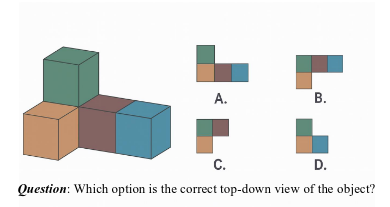

# System 1, 2 Denken: Vergleich kognitiver Modelle

Je nach Situation und Aufgabe greifen Menschen auf unterschiedliche Denkmodi zurück. Daniel Kahneman unterscheidet System 1 (schnell, intuitiv, emotional) und System 2 (langsam, analytisch, rational). Interessanterweise spiegeln sich diese Denkmodi auch in den Funktionsweisen von KI-Systemen wider. Manche KI-Modelle, wie z.B. neuronale Netze, arbeiten ähnlich wie System 1, indem sie Muster erkennen und schnelle Entscheidungen treffen. Andere, wie regelbasierte Systeme oder symbolische KI, ähneln eher System 2, da sie auf expliziten Regeln und logischen Schlussfolgerungen basieren. So waren die frühen LLMs (Large Language Models) eher System 1 Modelle, die durch Training auf großen Textmengen Muster erlernten und darauf basierend Antworten generierten. Neuere Ansätze, wie Chain of Thought, agentic LLMS oder Reasoning Models versuchen, System 2 Fähigkeiten zu integrieren, indem sie die Modelle dazu bringen, ihre Antworten zu begründen und komplexere Schlussfolgerungen zu ziehen.

Löst in Gruppen die folgenden Aufgaben einmal im System 1 Modus (schnell, intuitiv) und einmal im System 2 Modus (analytisch, überlegt). Vergleicht anschließend Eure Ergebnisse und diskutiert, wie sich die unterschiedlichen Denkmodi auf Eure Lösungsansätze ausgewirkt haben.

\newpage

## Gruppe 1: System 1 Denken

### Aufgabe

Nachdem Ihr die Aufgabe gelöst habt, versucht die Aufgabe mit ChatGPT GPT-5 zu lösen. Vergleicht Eure Antworten.

### Diskussion

Diese Aufgaben ist für Menschen einfach, aber für KI schwierig. Warum? Welche Fehlkonzepte könnt Ihr in den Antworten erkennen? Könnten Schüler:innen auch solche Fehler machen?

\newpage

## Gruppe 2: System 2 Denken

### Aufgabe

Löse dieses Rätsel: 

Du siehst zwei sich kreuzende Reihen von Münzen. Die eine besteht aus 4 Münzen die andere aus 3 Münzen, lege eine Münze so um das 2 Reihen mit je 4 Münzen entstehen.

{width=60%}

### Diskussion

Löst das zuerst selbst, und versucht es dann mit ChatGPT GPT-5. Wo muss man ChatGPT helfen? Könnte Schüler:innen auch solche Hilfen brauchen?

