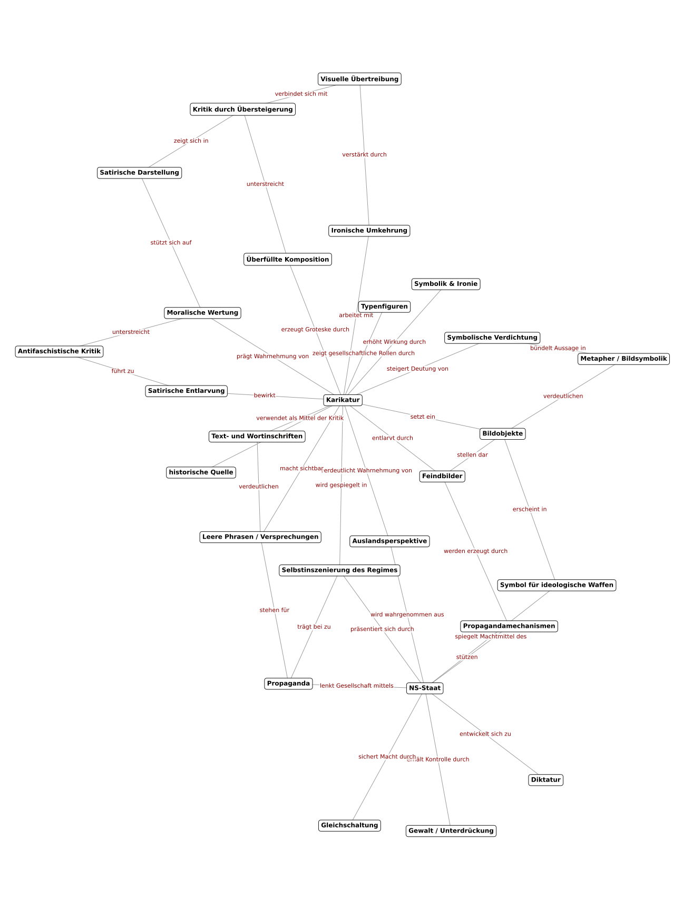

# Aufgabe

Wir haben die Lösungen zu einer Geschichtsaufgabe der Sekundarstufe II mit KI analysieren lassen, sind dabei aber zu keinem wirklich zufriedenstellenden Ergebnis gekommen.

Mit einem Konzeptdiagramm und Wissensrepräsentation können wir schnell erfassen, welche inhaltlichen Schwerpunkte die Aufgabe und die einzelnen Lösungen setzen. So lassen sich die Ergebnisse besser vergleichen und beurteilen.

Markiere für jede der Lösungen (A, B) die wichtigsten Begriffe und Zusammenhänge im beigefügten Konzeptdiagramm (Anhang).
Was fällt auf dir auf? In welchen zentralen Punkten unterscheiden sich die Lösungen?

\newpage

### Aufgabenstellung der Schüler*in

Diskutieren Sie, inwieweit die Karikatur M 1 als Quelle dazu geeignet ist, wesentliche Aspekte der gesellschaftlichen und politischen Verhältnisse im NS-Deutschland von 1933 bis 1935 darzustellen!

\vspace{0.5cm}

\begin{center}
\includegraphics[width=280px]{images/Karikatur.png}
\end{center}

Quelle: M1: „Nationalsozialistische Rüstkammer“, Nebelspalter (Schweiz), November 1935

### Lösung der Schüler*in A

Die Karikatur „Nationalsozialistische Rüstkammer“, erschienen 1935 in der Schweizer Satirezeitschrift *Nebelspalter*, stammt aus dem Ausland und stellt eine kritische Sicht auf das nationalsozialistische Deutschland dar. Sie zeigt vermutlich verschiedene „Waffen“ oder Werkzeuge, die symbolisch für die Herrschaftsmittel des NS-Staates stehen, etwa Propaganda, Kontrolle, Gewalt und Unterdrückung. Dadurch soll verdeutlicht werden, wie das NS-Regime seine Macht sichert und ausbaut. Die Darstellung ist bewusst übertrieben und satirisch, was typisch für politische Karikaturen dieser Zeit ist. Dadurch werden die Gefährlichkeit und Aggressivität der nationalsozialistischen Politik schon früh von außen erkannt und angeprangert.

Inhaltlich greift die Karikatur zentrale Aspekte der politischen und gesellschaftlichen Entwicklung zwischen 1933 und 1935 auf: die Gleichschaltung von Staat und Gesellschaft, die Ausschaltung politischer Gegner sowie den Aufbau einer totalitären Diktatur. Diese Prozesse begannen unmittelbar nach Hitlers Ernennung zum Reichskanzler 1933, wurden durch das Ermächtigungsgesetz, die Auflösung anderer Parteien und die Kontrolle der Medien vorangetrieben. Auch der Ausbau der Gestapo und der SS als Instrumente der Einschüchterung und Verfolgung wird indirekt angesprochen, da sie Teil der „Rüstung“ des Regimes waren. Ebenso kann die Betonung von Waffen auf die zunehmende Aufrüstung und den Bruch des Versailler Vertrages hindeuten, was ab 1935 mit der Einführung der Wehrpflicht deutlich wurde.

Als Quelle ist die Karikatur eingeschränkt geeignet, die Verhältnisse im NS-Staat darzustellen. Einerseits bietet sie eine zeitgenössische Deutung und macht wichtige Merkmale des Regimes wie Gewalt, Propaganda und Militarisierung deutlich. Besonders wertvoll ist, dass sie eine außenpolitische Perspektive aufzeigt: Während die Bevölkerung in Deutschland durch Propaganda beeinflusst wurde, erkannten ausländische Beobachter schon früh die Gefahren des totalitären Systems. Damit spiegelt die Karikatur nicht nur die inneren Strukturen des NS-Staates, sondern auch seine Wirkung nach außen. Andererseits handelt es sich um eine satirische Darstellung aus dem Ausland, also keine innere Perspektive aus Deutschland. Die Übertreibung und Zuspitzung dienen der Kritik und können die Verhältnisse verzerrt wiedergeben. Zudem fehlen konkrete Informationen über einzelne Ereignisse oder Gesetze.

Insgesamt vermittelt die Karikatur dennoch ein zutreffendes und aufschlussreiches Bild der autoritären und aggressiven Grundzüge des nationalsozialistischen Systems. Sie ist somit geeignet, zentrale Tendenzen dieser Zeit zu verdeutlichen, wenn man ihren satirischen Charakter und ihre Herkunft berücksichtigt. Die Quelle besitzt daher hohen interpretativen Wert, da sie exemplarisch zeigt, wie sich bereits Mitte der 1930er Jahre die diktatorische Natur des NS-Regimes und seine kriegerische Ausrichtung nach außen abzeichneten. Durch die Verbindung von Symbolik, Ironie und politischer Aussagekraft wird sie zu einem eindrucksvollen Zeugnis der zeitgenössischen Wahrnehmung des Nationalsozialismus.

\newpage

### Lösung der Schüler*in B

Die Karikatur „Nationalsozialistische Rüstkammer“ von Gregor Rabinovitch erschien im November 1935 in der Schweizer Satirezeitschrift *Nebelspalter*. Sie zeigt eine überfüllte Werkstatt, die als „Waffenkammer“ des nationalsozialistischen Regimes inszeniert ist. Der Titel ist ironisch gemeint: Die dargestellten Waffen sind keine Gewehre oder Kanonen, sondern Worte, Phrasen, Feindbilder und Symbole, die als ideologische Instrumente des NS-Staates dienen. Damit greift Rabinovitch die geistige und sprachliche Aufrüstung des Regimes auf.

Im Raum drängen sich zahlreiche Figuren und Gegenstände. Zu erkennen sind Kisten, Schilder und Pappfiguren mit Aufschriften wie „Pazifisten“, „Kulturbolschewik“, „Schwarze Gefahr“ oder „Hetzreden“. Diese Begriffe stehen für Feindbilder der NS-Propaganda, mit denen Gegner diffamiert und Angst erzeugt wurde. Über den Figuren hängt das Schild „Vogelscheuchen“ – eine sarkastische Bezeichnung für diese Feindbilder, die der NS-Staat wie Attrappen aufstellt, um seine Anhänger zu mobilisieren.

Zwischen den Figuren erscheinen verschiedene Typen: ein Kapitalist mit Geldsack, ein Pfarrer, ein Demokrat und ein SS-Mann. Sie verkörpern gesellschaftliche Gruppen, die im System entweder mitwirkten oder bekämpft wurden. Ein uniformierter Mann mit Hakenkreuz-Armbinde sitzt an einem Schreibtisch mit der Aufschrift „Leihanstalt“ und zählt Münzen – ein Sinnbild für Zynismus, Korruption und Berechnung. Daneben steht eine Kiste mit der Aufschrift „Reden – fertig zum Gebrauch“, die auf die propagandistische Massenproduktion von Parolen verweist. Über der Szene stapeln sich Bücher mit dem Titel „Mein Kampf“, das ideologische Fundament des Regimes, hier als Massenware entwertet. Über allem schweben kleine, hilflose Figuren mit Flügeln, ironisch als „Pazifisten“ bezeichnet – sie stehen für die ohnmächtige Opposition gegenüber der nationalsozialistischen Gewalt- und Sprachherrschaft.

Rabinovitch nutzt Übertreibung, Ironie und Symbolüberlagerung, um die Mechanismen der NS-Herrschaft zu entlarven. Die Rüstkammer wirkt chaotisch, grotesk und überladen, was die totalitäre Selbstinszenierung von Ordnung und Disziplin ins Gegenteil verkehrt. Die Karikatur zeigt, dass die eigentlichen Waffen des NS-Staates nicht militärisch, sondern ideologisch sind: Sprache, Lüge, Feindbilder und Propaganda. Das Arsenal der Worte ersetzt die Armee der Waffen. Damit wird der Begriff „Rüstkammer“ zur Metapher für ein System, das sich mit Hetze, Angst und Täuschung bewaffnet.

Die Entstehungszeit 1935 markiert eine Phase, in der das NS-Regime seine Macht bereits gefestigt hatte. Gleichschaltung, Pressezensur und Propaganda bestimmten den öffentlichen Diskurs, die Wehrpflicht wurde wieder eingeführt, der Versailler Vertrag offen gebrochen. Als Schweizer Beitrag bietet Rabinovitchs Karikatur eine Außenperspektive auf diese Entwicklung. Sie ist weniger eine nüchterne Analyse als eine visuelle Warnung vor der ideologischen Aufrüstung Deutschlands. Durch den satirischen Stil gelingt es, das System der nationalsozialistischen Herrschaft als überdreht und moralisch verkommen erscheinen zu lassen.

Der Quellenwert der Karikatur liegt weniger in einer objektiven Darstellung als in ihrer satirischen Verdichtung. Sie zeigt, wie das Regime von außen wahrgenommen wurde: als Bedrohung, die sich mit Worten und Symbolen bewaffnet. Der moralische Unterton macht deutlich, dass Rabinovitch nicht bloß kritisiert, sondern warnt – vor einem System, das Sprache in eine Waffe verwandelt.

„Nationalsozialistische Rüstkammer“ verbindet politische Analyse und künstlerische Übertreibung zu einem eindringlichen Zeitdokument. Die Karikatur ist eine satirische Demaskierung der nationalsozialistischen Selbstinszenierung, eine visuelle Kritik an der Manipulation durch Propaganda und Angst. Sie macht sichtbar, wie das Regime seine Macht mit Worten und Bildern festigte, und ist damit eine aufschlussreiche Quelle zur politischen Kultur und Wahrnehmung des frühen NS-Staates.

\newpage

# Anhang
## Wissensrepräsentation

{width=700px}

# Weiterführende Informationen

Die Aufgabe der Schüler*innen stammt aus einer Abiturprüfung im Fach Geschichte.

Die Lösungen der Schüler*innen A und B wurden mithilfe von ChatGPT erstellt. Bei A wurde fälschlicherweise lediglich der Text der Aufgabe als Eingabe verwendet. Bei B wurde hingegen zuerst das Bild hochgeladen, anschließend von ChatGPT beschrieben und diese Beschreibung als Kontext für die eigentliche Lösung genutzt.

Der kluge Umgang mit Sprachrobotern zeigt Smartness, aber keine Geschichtskompetenz.
Historische Kompetenz zeigt sich erst, wenn KI-Ergebnisse kritisch reflektiert und in eigenes Denken überführt werden.

Der Konzeptgraph wurde ebenfalls mit ChatGPT erstellt. Zunächst wurde eine übererfüllende Musterlösung generiert, anschließend bat man die KI, die zentralen Begriffe und Zusammenhänge daraus zu extrahieren und sie mit Python (unter Verwendung der Bibliotheken networkx, matplotlib und pygraphviz) in einem Konzeptdiagramm darzustellen.

## Was lässt sich daraus lernen?

Klassische Methoden wie Knowledge Representation und Concept Mapping sind sehr hilfreich, um komplexe Sachverhalte zu strukturieren und visuell zu erfassen. Sie ermöglichen es, die wichtigsten Konzepte und ihre Beziehungen zu identifizieren und übersichtlich darzustellen.

Sprachmodelle wie ChatGPT können diese Methoden sinnvoll unterstützen, indem sie helfen, Komplexität zu reduzieren und die Verständlichkeit zu erhöhen. Dennoch ist es wichtig, die Grenzen der KI zu erkennen und sie als Werkzeug einzusetzen – nicht als Ersatz für menschliches Denken, Interpretation und kritische Analyse.